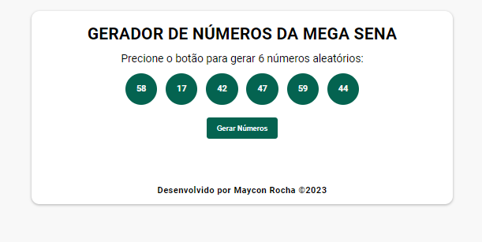

# GERADOR DE NÚMEROS DA MEGA SENA

Projeto desenvolvido através do curso de JavaScript com o professor Matheus Battisti na plataforma da Udemy.

Foram utilizadas as tecnologias HTML / CSS / JAVASCRIPT

